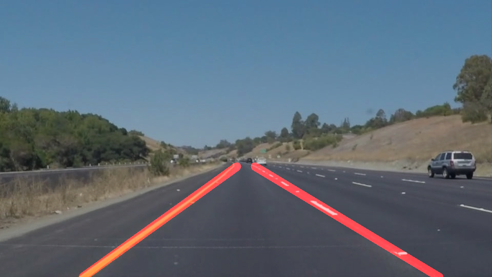

# **Finding Lane Lines on the Road** 

---

## Overview

When we drive, we use our eyes to decide where to go. The lines on the road that show us where the lanes are act as our constant reference for where to steer the vehicle. Naturally, one of the first things we would like to do in developing a self-driving car is to automatically detect lane lines using an algorithm.

In this project, as part of the Udacity SDCND, a pipeline that detects lane lines in images using Python and OpenCV is developed.

## Description of the pieline

My pipeline consisted of the following steps.

1- Conversion to grayscale

2- Masking the grayscale image with white and yellow color masks

3- Gaussian blur with kernel 5

4- Canny edge detection

5- Region of interest masking

6- Hough transform and draw-line() function to detect the left and right lines and drawing them on the image 

7 - Overlaying the line image on original image.

The drawline() function takes the Hough lines and:

* Separates the left and right lines coordinates based on thier slopes. In case no left or right line is detected, or variance of the line slopes is abnormal, the function returns the lines from previous frame.
* Fits a first order polynomial (line) over the coordinates (x,y) of the left and right Hough lines.
* Calculates the coordinates of the continues left and right lines based on the fit parameters.
* If the left and right lines cross each other, calcluates the intersection and replaces the top points to the intersection.
* Combines the line coordinates of the current frame (previous step) with the previous frame with a ratio.
* Adds the left and right lines to a blank image 

## Test

### On images:
First, the pipeline is tested on sample images. A sample of the input images is:

 
 
 
 
 

and after passing to the pipeline the lines are detected on the image: 

 

### On videos

The pipline is also tested on the video frames of "solidWhiteRight.mp4" and "solidYellowLeft.mp4" in the "test_videos" folder. The outputs videos are saved in the "test_videos_output" folder and showes that the lines are detected.

## Identify potential shortcomings with your current pipeline

Potential shorcommings are when:

1- Low light condition (e.g. at night, tunnel)

2- Lines have collors other than yellow or white

3- There are other objects in the masked region of the image (e.g. roadside guard, not uniform road color)

4- The road turns sharply

5- The road has one line or no line

## Suggest possible improvements to your pipeline

A possible improvement would be to:
